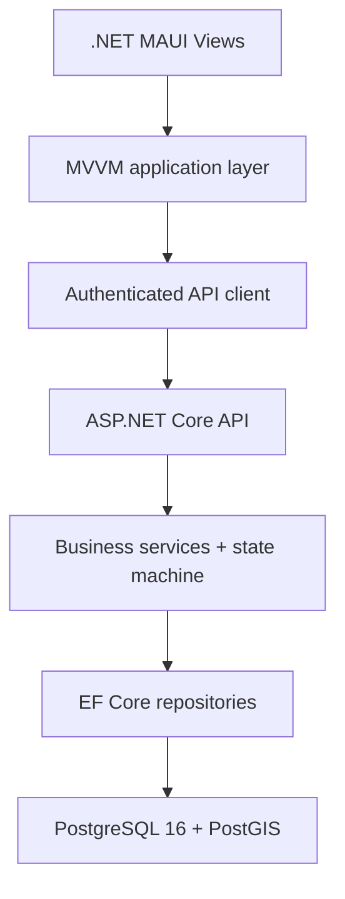
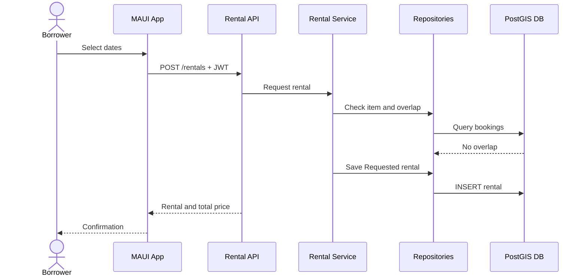
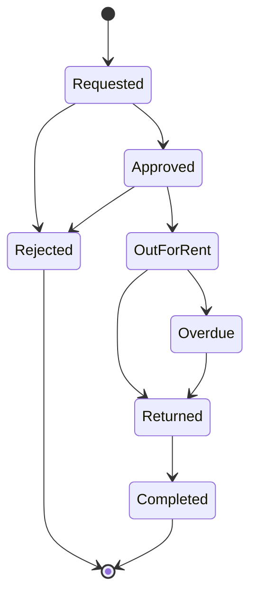

# RentalApp architecture

## Component diagram



The Views contain only binding and navigation lifecycle code. ViewModels coordinate user actions through interfaces. The API owns validation and security. Repositories own persistence and spatial queries. This prevents UI code from bypassing business rules or connecting directly to PostgreSQL.

## Database schema

```mermaid
erDiagram
    USER ||--o{ ITEM : owns
    USER ||--o{ RENTAL : borrows
    USER ||--o{ REVIEW : writes
    USER ||--o{ REFRESH_TOKEN : receives
    ITEM ||--o{ RENTAL : booked_as
    ITEM ||--o{ REVIEW : receives
    RENTAL ||--o| REVIEW : produces

    USER {
        uuid Id PK
        string Email UK
        string DisplayName
        string PasswordHash
    }
    ITEM {
        uuid Id PK
        uuid OwnerId FK
        string Title
        decimal DailyRate
        string Address
        geography Location
    }
    RENTAL {
        uuid Id PK
        uuid ItemId FK
        uuid BorrowerId FK
        datetime StartDateUtc
        datetime EndDateUtc
        string Status
    }
    REVIEW {
        uuid Id PK
        uuid RentalId FK_UK
        uuid ItemId FK
        int Rating
        string Comment
    }
```

`Item.Address` stores the readable collection address. The MAUI client resolves
typed addresses through platform geocoding, or reverse-geocodes the device GPS
position, before sending the address and coordinates to the API. The API still
validates coordinate and address bounds. `Item.Location` is
`GEOGRAPHY(POINT, 4326)` and has a GiST index. The nearby repository query is
translated by the Npgsql NetTopologySuite provider to PostGIS distance
operations, including `ST_DWithin` semantics.

## Rental request sequence



## Rental state diagram



Each state class declares only its permitted next states. The service separately checks whether the current user is the item owner or borrower. This keeps workflow validity and authorisation as distinct responsibilities.
